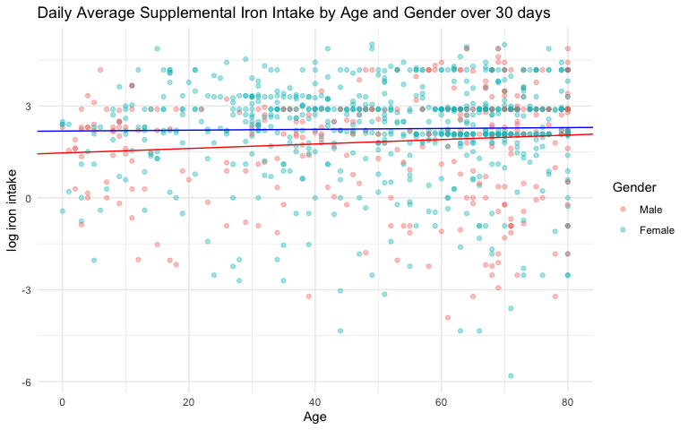
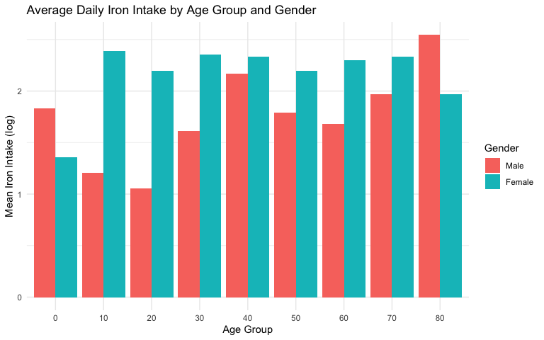
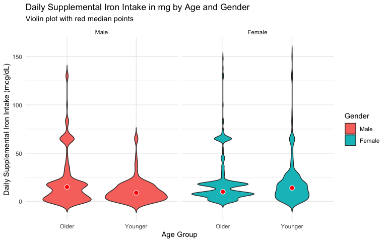

Supplemental Iron Intake by Age and Gender
================
Alissa Weng

## About this project

Originally completed as a four-person group project for PH 142
(Introduction to Probability and Statistics in Biology and Public
Health) at UC Berkeley, Spring 2026.

My contributions were the data import, visualizations, the distribution
and probability work, the hypotheses, and the Wilcoxon rank-sum tests.

Ally worked alongside me on the coding and statistical questions;
Bharathi and Eve led the explanatory and interpretive sections. Many
questions were collaborative, and all four of us reviewed and approved
the final version.

## Question

Do older adults report lower average daily iron intake from dietary
supplements over the past 30 days than younger adults, and does this age
pattern differ by gender?

In PPDAC terms, stratifying by gender makes this a comparative
relationship question. Without the gender stratification it would be a
descriptive comparative question.

## Data

Publicly available data from the U.S. National Health and Nutrition
Examination Survey (NHANES), August 2021 to August 2023 cycle. Two files
are used:

- `DEMO_L.xpt`, demographics (age, gender)
- `DSQTOT_L.xpt`, total dietary supplements, giving average daily
  nutrient intake from supplements and non-prescription antacids over
  the past 30 days

Both are downloadable from <https://wwwn.cdc.gov/nchs/nhanes/>.

The sampling frame is the U.S. civilian non-institutionalized population
sampled between August 2021 and August 2023. NHANES uses probability
sampling, so findings generalize to that population over that period.

## Load and merge data

``` r
library(foreign)
library(dplyr)

Total_Dietary_Supplements <- read.xport("DSQTOT_L.xpt")
Demographics <- read.xport("DEMO_L.xpt")

write.csv(Total_Dietary_Supplements, "Total_Dietary_Supplements.csv", row.names = FALSE)
write.csv(Demographics, "Demographics.csv", row.names = FALSE)

Total_Dietary_Supplements <- read.csv("Total_Dietary_Supplements.csv")
Demographics <- read.csv("Demographics.csv")

# SEQN is the respondent ID shared by both files.
demo_keep <- Demographics %>% select(SEQN, RIDAGEYR, RIAGENDR)
iron_keep <- Total_Dietary_Supplements %>% select(SEQN, DSQTIRON)

combined <- iron_keep %>% left_join(demo_keep, by = "SEQN")
```

``` r
dim(combined)
```

    ## [1] 8860    4

``` r
names(combined)
```

    ## [1] "SEQN"     "DSQTIRON" "RIDAGEYR" "RIAGENDR"

``` r
head(combined, 6)
```

    ##     SEQN DSQTIRON RIDAGEYR RIAGENDR
    ## 1 130378       NA       43        1
    ## 2 130379       NA       66        1
    ## 3 130380    0.013       44        2
    ## 4 130381    8.000        5        2
    ## 5 130382       NA        2        1
    ## 6 130386    3.600       34        1

## Clean and transform

``` r
# RIAGENDR is coded 1 = Male, 2 = Female.
combined_gender <- combined %>%
  mutate(Gender = factor(RIAGENDR, levels = c(1, 2), labels = c("Male", "Female")))

# Raw iron intake has many zero and near-zero values plus a few large ones,
# so most points pile up at the bottom. A natural log spreads the low end and
# compresses the high outliers.
combined_gender_log <- combined_gender %>%
  mutate(iron_log = log(DSQTIRON))
```

## Linear fits by gender

``` r
library(broom)

females <- combined_gender_log %>% filter(Gender == "Female")
males   <- combined_gender_log %>% filter(Gender == "Male")

female_lm <- lm(iron_log ~ RIDAGEYR, data = females)
male_lm   <- lm(iron_log ~ RIDAGEYR, data = males)
total_trend <- lm(DSQTIRON ~ RIDAGEYR, data = combined)

glance(male_lm)   %>% pull(r.squared)
```

    ## [1] 0.01033269

``` r
glance(female_lm) %>% pull(r.squared)
```

    ## [1] 0.0003781371

``` r
glance(total_trend) %>% pull(r.squared)
```

    ## [1] 0.00909209

## Plot 1: log intake against age, by gender

``` r
library(ggplot2)

ggplot(combined_gender_log, aes(x = RIDAGEYR, y = iron_log, col = Gender)) +
  geom_point(na.rm = TRUE, alpha = 0.4) +
  labs(
    x = "Age",
    y = "log iron intake",
    title = "Daily Average Supplemental Iron Intake by Age and Gender over 30 days"
  ) +
  theme_minimal() +
  geom_abline(intercept = 2.178715, slope = 0.001437, col = "blue") +
  geom_abline(intercept = 1.463298, slope = 0.007339, col = "red")
```

<!-- -->

This demonstrates data transformation and visualization: recoding gender
into a categorical factor, transforming a bottom-dense variable with a
natural log, then using a scatter plot with fitted lines for each gender
to explore the association between two variables. Coloring by gender
lets both groups be compared in one figure, and `alpha = 0.4` makes
overlapping regions visible.

Overall the points show low iron intake across ages. The linear
associations for both genders are very weak, with slight slopes and low
r-squared, indicating no particular association between iron intake and
age. Males show a slightly steeper slope and higher r-squared,
suggesting a marginally stronger association.

## Plot 2: mean intake by 10-year age band

``` r
binned_data <- combined_gender_log %>%
  mutate(Age_Group = floor(RIDAGEYR / 10) * 10) %>%
  group_by(Gender, Age_Group) %>%
  summarise(mean_iron = mean(iron_log, na.rm = TRUE), .groups = "drop")

ggplot(binned_data, aes(x = factor(Age_Group), y = mean_iron, fill = Gender)) +
  geom_bar(stat = "identity", position = position_dodge()) +
  labs(
    title = "Average Daily Iron Intake by Age Group and Gender",
    x = "Age Group",
    y = "Mean Iron Intake (log)",
    fill = "Gender"
  ) +
  theme_minimal()
```

<!-- -->

Because the outcome is on a log scale, differences that look small are
substantial. The largest gap between genders appears early in life, with
women reporting much higher iron intake than men in the 10 and 20 year
bins, which infer association with higher iron requirements during
menstruation. Intake converges around the 50 year bin, when menopause
occurs and less additional iron is needed. After that the pattern
reverses, with men reporting higher intake in the 80 year bin, possibly
reflecting anemia in elderly men.

## Statistical test

The outcome is continuous, highly right-skewed, and holds many zero
values, and the two groups (younger and older adults) are independent. A
Wilcoxon rank-sum test is therefore more appropriate than a two-sample
t-test, which assumes normality. The rank-sum test compares
distributions using ranks, so a difference between age groups can be
assessed without a normal distribution.

**Null hypothesis.** The distribution of daily supplemental iron intake
is the same for older adults (age \>= 50) and younger adults (age \<
50).

**Alternative hypothesis.** The distribution differs between older and
younger adults.

``` r
# prepare data, remove missing values, separate ages
iron_data <- combined_gender %>%
  filter(!is.na(DSQTIRON)) %>%
  mutate(Age_Group = ifelse(RIDAGEYR >= 50, "Older", "Younger"))

# split by gender so the tests run separately within each group
females <- iron_data %>% filter(Gender == "Female")
males   <- iron_data %>% filter(Gender == "Male")

wilcox_female <- wilcox.test(DSQTIRON ~ Age_Group, data = females)
wilcox_female
```

    ## 
    ##  Wilcoxon rank sum test with continuity correction
    ## 
    ## data:  DSQTIRON by Age_Group
    ## W = 61829, p-value = 0.2634
    ## alternative hypothesis: true location shift is not equal to 0

``` r
wilcox_male <- wilcox.test(DSQTIRON ~ Age_Group, data = males)
wilcox_male
```

    ## 
    ##  Wilcoxon rank sum test with continuity correction
    ## 
    ## data:  DSQTIRON by Age_Group
    ## W = 13848, p-value = 0.01579
    ## alternative hypothesis: true location shift is not equal to 0

``` r
iron_data %>%
  group_by(Gender, Age_Group) %>%
  summarise(
    count  = n(),
    median = median(DSQTIRON, na.rm = TRUE),
    IQR    = IQR(DSQTIRON, na.rm = TRUE),
    .groups = "drop"
  )
```

    ## # A tibble: 4 × 5
    ##   Gender Age_Group count median   IQR
    ##   <fct>  <chr>     <int>  <dbl> <dbl>
    ## 1 Male   Older       191   14.9  15.7
    ## 2 Male   Younger     125    9    14.9
    ## 3 Female Older       439   10    10.5
    ## 4 Female Younger     296   14    17.3

## Plot 3: distribution by age group and gender

``` r
ggplot(iron_data, aes(x = Age_Group, y = DSQTIRON, fill = Gender)) +
  geom_violin(trim = FALSE) +
  stat_summary(fun = median, geom = "point", shape = 21, size = 3,
               color = "white", fill = "red") +
  facet_wrap(~ Gender) +
  labs(
    title = "Daily Supplemental Iron Intake in mg by Age and Gender",
    subtitle = "Violin plot with red median points",
    x = "Age Group",
    y = "Daily Supplemental Iron Intake (mcg/dL)"
  ) +
  theme_minimal()
```

<!-- -->

A violin plot presents the rank-sum results because it shows the full
spread of the data with the median marked in red. The male violins
differ visibly from each other, matching the statistically significant
difference in iron intake between older and younger men. The higher
p-value for women indicates insufficient evidence of a difference
between younger and older women.

## Interpretation

For females the p-value was 0.2634, above 0.05, so there is not enough
evidence to reject the null hypothesis. For males the p-value was
0.01579, below 0.05, so the null is rejected. Iron intake from
supplements differs by age group among men but not among women.

Several factors beyond age likely contribute. NHANES excludes people in
institutions such as hospitals, nursing homes, and prisons, which
introduces selection bias. The supplement data is self-reported and
therefore subject to inaccuracy. Confounding variables not included
here, including health status, income, and diet, could influence whether
someone takes iron supplements and could explain part of the observed
difference.
